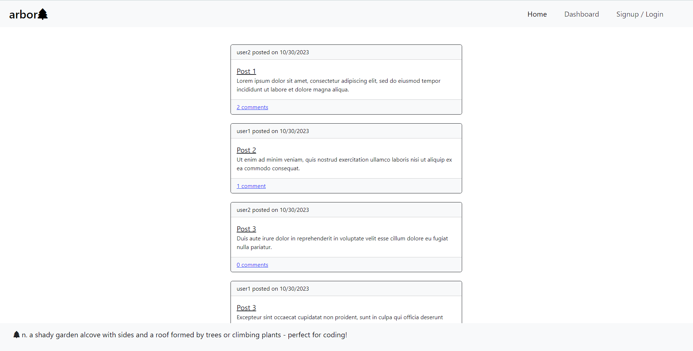

# Tech Blog

## Description

This tech blog app is a CMS-style blog site similar to a Wordpress site, where developers can publish their blog posts and comment on other developers’ posts as well.

## Installation

N/A

## Usage

Deployment:

Preview:

## Credits

Accessing css in handlebars: https://stackoverflow.com/questions/47371954/cannot-access-stylesheet-with-handlebars

## License

N/A
